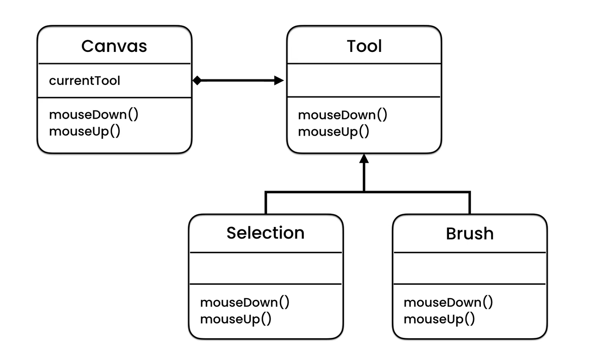

The state pattern is like an application on polymorphism, it allows for different actions, for different object type.

Imagine the photoshop app, the functionality of the cursor changes based on the selection like brush, eraser, etc.

This pattern makes supports the **open close principle**

